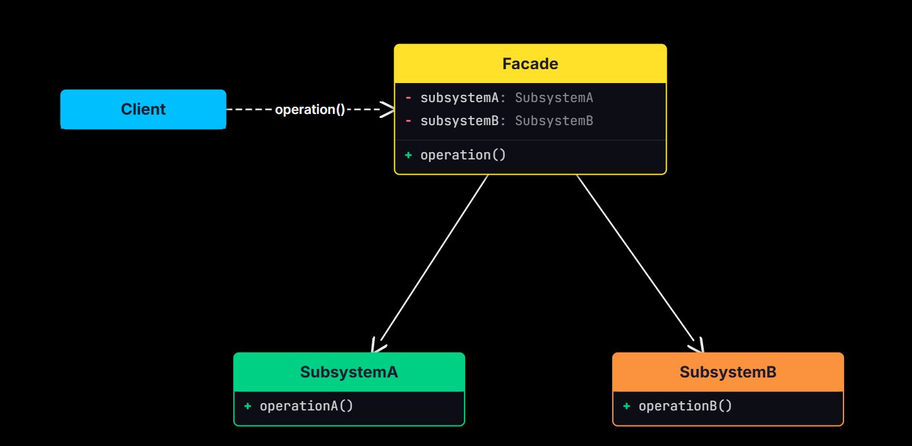
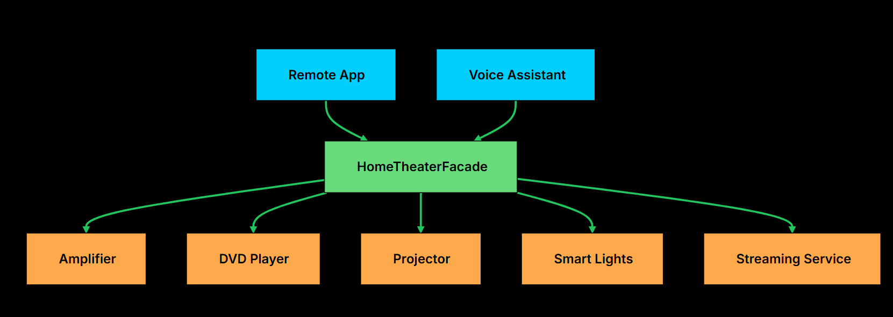

# Facade Design Pattern

A Facade acts as a single point of entry (**single, simplified interface to a complex subsystem**) to a complex subsystem. It does not add new capabilities; it merely orchestrates existing ones so the client doesn't have to deal with the messy.

**Example**: In an e-commerce system, an
Order Facade class might provide a single method `placeOrder()`. Internally, this method coordinates separate subsystems: `InventoryCheck()`, `PaymentProcessor()`, and `ShippingService()`. The client remains decoupled from these underlying modules.

- Use a Facade when you want to make a complex system easier to use.

- Use an Adapter when you want to make two incompatible systems work together.

It’s particularly useful in situations where:

- Your system contains many interdependent classes or low-level APIs.
- The client doesn’t need to know how those parts work internally.
- You want to reduce coupling and make the system easier to learn and use.


In real applications, a “simple” task often requires orchestrating multiple components. Without a facade, each client ends up talking to several subsystems directly, and coordinating the sequence on its own.


## The Problem: Deployment Complexity

Let's say you're building a deployment automation tool for your development team.

On the surface, deploying an application may seem like a straightforward task, but in reality, it involves a sequence of coordinated, error-prone steps:

1. Pull the latest code from a Git repository
2. Build the project using a tool like Maven or Gradle
3. Run automated tests (unit, integration, maybe end-to-end)
4. Deploy the build artifact to a production environment

Each of these steps might be handled by a separate module or class, each with its own specific API and configuration.


<details>
<summary>Python</summary>

```python
class VersionControlSystem:
    def pull_latest_changes(self, branch):
        print(f"VCS: Pulling latest changes from '{branch}'...")
        self._simulate_delay()
        print("VCS: Pull complete.")

    def _simulate_delay(self):
        time.sleep(1)

class BuildSystem:
    def compile_project(self):
        print("BuildSystem: Compiling project...")
        self._simulate_delay(2)
        print("BuildSystem: Build successful.")
        return True

    def get_artifact_path(self):
        path = "target/myapplication-1.0.jar"
        print(f"BuildSystem: Artifact located at {path}")
        return path

    def _simulate_delay(self, seconds):
        time.sleep(seconds)

class TestingFramework:
    def run_unit_tests(self):
        print("Testing: Running unit tests...")
        self._simulate_delay(1.5)
        print("Testing: Unit tests passed.")
        return True

    def run_integration_tests(self):
        print("Testing: Running integration tests...")
        self._simulate_delay(3)
        print("Testing: Integration tests passed.")
        return True

    def _simulate_delay(self, seconds):
        time.sleep(seconds)

class DeploymentTarget:
    def transfer_artifact(self, artifact_path, server):
        print(f"Deployment: Transferring {artifact_path} to {server}...")
        self._simulate_delay(1)
        print("Deployment: Transfer complete.")

    def activate_new_version(self, server):
        print(f"Deployment: Activating new version on {server}...")
        self._simulate_delay(0.5)
        print(f"Deployment: Now live on {server}!")

    def _simulate_delay(self, seconds):
        time.sleep(seconds)

## Client Code Without Facade

import sys

class DeploymentClient:
    @staticmethod
    def main() -> None:
        branch = "main"
        prod_server = "prod.server.example.com"

        # Client must create and manage all subsystems
        vcs = VersionControlSystem()
        build_system = BuildSystem()
        test_framework = TestingFramework()
        deploy_target = DeploymentTarget()

        print(f"\n[Client] Starting deployment for branch: {branch}")

        # Step 1: Pull latest code
        vcs.pull_latest_changes(branch)

        # Step 2: Build the project
        if not build_system.compile_project():
            print("[Client] Build failed. Deployment aborted.", file=sys.stderr)
            return
        artifact = build_system.get_artifact_path()

        # Step 3: Run tests
        if not test_framework.run_unit_tests():
            print("[Client] Unit tests failed. Deployment aborted.", file=sys.stderr)
            return
        if not test_framework.run_integration_tests():
            print("[Client] Integration tests failed. Deployment aborted.", file=sys.stderr)
            return

        # Step 4: Deploy to production
        deploy_target.transfer_artifact(artifact, prod_server)
        deploy_target.activate_new_version(prod_server)

        print("[Client] Deployment successful!")

```

</details>

<details>
<summary>C++</summary>

```cpp
class VersionControlSystem {
public:
   void pullLatestChanges(string branch) {
       cout << "VCS: Pulling latest changes from '" << branch << "'..." << endl;
       simulateDelay();
       cout << "VCS: Pull complete." << endl;
   }

private:
   void simulateDelay() {
       this_thread::sleep_for(chrono::milliseconds(1000));
   }
};


class BuildSystem {
public:
   bool compileProject() {
       cout << "BuildSystem: Compiling project..." << endl;
       simulateDelay(2000);
       cout << "BuildSystem: Build successful." << endl;
       return true;
   }

   string getArtifactPath() {
       string path = "target/myapplication-1.0.jar";
       cout << "BuildSystem: Artifact located at " << path << endl;
       return path;
   }

private:
   void simulateDelay(int ms) {
       this_thread::sleep_for(chrono::milliseconds(ms));
   }
};

class TestingFramework {
public:
   bool runUnitTests() {
       cout << "Testing: Running unit tests..." << endl;
       simulateDelay(1500);
       cout << "Testing: Unit tests passed." << endl;
       return true;
   }

   bool runIntegrationTests() {
       cout << "Testing: Running integration tests..." << endl;
       simulateDelay(3000);
       cout << "Testing: Integration tests passed." << endl;
       return true;
   }

private:
   void simulateDelay(int ms) {
       this_thread::sleep_for(chrono::milliseconds(ms));
   }
};


class DeploymentTarget {
public:
   void transferArtifact(string artifactPath, string server) {
       cout << "Deployment: Transferring " << artifactPath << " to " << server << "..." << endl;
       simulateDelay(1000);
       cout << "Deployment: Transfer complete." << endl;
   }

   void activateNewVersion(string server) {
       cout << "Deployment: Activating new version on " << server << "..." << endl;
       simulateDelay(500);
       cout << "Deployment: Now live on " << server << "!" << endl;
   }

private:
   void simulateDelay(int ms) {
       this_thread::sleep_for(chrono::milliseconds(ms));
   }
};

// Client Code Without Facade

class DeploymentClient {
public:
    static int Main() {
        string branch = "main";
        string prodServer = "prod.server.example.com";

        // Client must create and manage all subsystems
        VersionControlSystem vcs;
        BuildSystem buildSystem;
        TestingFramework testFramework;
        DeploymentTarget deployTarget;

        cout << "\n[Client] Starting deployment for branch: " << branch << "\n";

        // Step 1: Pull latest code
        vcs.pullLatestChanges(branch);

        // Step 2: Build the project
        if (!buildSystem.compileProject()) {
            cerr << "[Client] Build failed. Deployment aborted.\n";
            return 0;
        }
        string artifact = buildSystem.getArtifactPath();

        // Step 3: Run tests
        if (!testFramework.runUnitTests()) {
            cerr << "[Client] Unit tests failed. Deployment aborted.\n";
            return 0;
        }
        if (!testFramework.runIntegrationTests()) {
            cerr << "[Client] Integration tests failed. Deployment aborted.\n";
            return 0;
        }

        // Step 4: Deploy to production
        deployTarget.transferArtifact(artifact, prodServer);
        deployTarget.activateNewVersion(prodServer);

        cout << "[Client] Deployment successful!\n";
        return 0;
    }
};

```

</details>
<br/>


Now imagine you need to deploy from another part of your application, maybe a webhook handler, a scheduled job, or a different service. You would have to duplicate this entire sequence of calls, along with all the error handling logic.


### What’s Wrong with This Design?

**1. High Client Complexity**

**2. Tight Coupling**: 
The client directly depends on VersionControlSystem, BuildSystem, TestingFramework, and DeploymentTarget. 

**3. Poor Maintainability**



#### Facade (e.g., DeploymentFacade)
Knows which subsystem classes to use and in what order. Delegates requests to appropriate subsystem methods without exposing internal details to the client.


## Implementing the Facade

Rather than forcing the client to call each of these subsystems in the correct order, the facade abstracts this coordination logic and offers a clean, high-level method like deployApplication() that executes the full workflow.


<details>
<summary>Python</summary>

```python
class DeploymentFacade:
   def __init__(self):
       self.vcs = VersionControlSystem()
       self.build_system = BuildSystem()
       self.testing_framework = TestingFramework()
       self.deployment_target = DeploymentTarget()

   def deploy_application(self, branch, server_address):
       print(f"\nFACADE: --- Initiating FULL DEPLOYMENT for branch: {branch} to {server_address} ---")
       success = True

       try:
           self.vcs.pull_latest_changes(branch)

           if not self.build_system.compile_project():
               print("FACADE: DEPLOYMENT FAILED - Build compilation failed.", file=sys.stderr)
               return False

           artifact_path = self.build_system.get_artifact_path()

           if not self.testing_framework.run_unit_tests():
               print("FACADE: DEPLOYMENT FAILED - Unit tests failed.", file=sys.stderr)
               return False

           if not self.testing_framework.run_integration_tests():
               print("FACADE: DEPLOYMENT FAILED - Integration tests failed.", file=sys.stderr)
               return False

           self.deployment_target.transfer_artifact(artifact_path, server_address)
           self.deployment_target.activate_new_version(server_address)

           print(f"FACADE: APPLICATION DEPLOYED SUCCESSFULLY to {server_address}!")
       except Exception as e:
           print(f"FACADE: DEPLOYMENT FAILED - An unexpected error occurred: {str(e)}", file=sys.stderr)
           import traceback
           traceback.print_exc()
           success = False

       return success

## Using the Facade from the Client


class DeploymentAppFacade:
   @staticmethod
   def main():
       deployment_facade = DeploymentFacade()

       # Deploy to production
       deployment_facade.deploy_application("main", "prod.server.example.com")

       # Deploy a feature branch to staging
       print("\n--- Deploying feature branch to staging ---")
       deployment_facade.deploy_application("feature/new-ui", "staging.server.example.com")

if __name__ == "__main__":
   DeploymentAppFacade.main()
```

</details>

<details>
<summary>C++</summary>

```cpp
class DeploymentFacade {
private:
   VersionControlSystem vcs;
   BuildSystem buildSystem;
   TestingFramework testingFramework;
   DeploymentTarget deploymentTarget;

public:
   bool deployApplication(string branch, string serverAddress) {
       cout << "\nFACADE: --- Initiating FULL DEPLOYMENT for branch: " << branch << " to " << serverAddress << " ---" << endl;
       bool success = true;

       try {
           vcs.pullLatestChanges(branch);

           if (!buildSystem.compileProject()) {
               cerr << "FACADE: DEPLOYMENT FAILED - Build compilation failed." << endl;
               return false;
           }

           string artifactPath = buildSystem.getArtifactPath();

           if (!testingFramework.runUnitTests()) {
               cerr << "FACADE: DEPLOYMENT FAILED - Unit tests failed." << endl;
               return false;
           }

           if (!testingFramework.runIntegrationTests()) {
               cerr << "FACADE: DEPLOYMENT FAILED - Integration tests failed." << endl;
               return false;
           }

           deploymentTarget.transferArtifact(artifactPath, serverAddress);
           deploymentTarget.activateNewVersion(serverAddress);

           cout << "FACADE: APPLICATION DEPLOYED SUCCESSFULLY to " << serverAddress << "!" << endl;
       } catch (exception& e) {
           cerr << "FACADE: DEPLOYMENT FAILED - An unexpected error occurred: " << e.what() << endl;
           success = false;
       }

       return success;
   }
};


// Using the Facade from the Client

class DeploymentAppFacade {
public:
   static void main() {
       DeploymentFacade deploymentFacade;

       // Deploy to production
       deploymentFacade.deployApplication("main", "prod.server.example.com");

       // Deploy a feature branch to staging
       cout << "\n--- Deploying feature branch to staging ---" << endl;
       deploymentFacade.deployApplication("feature/new-ui", "staging.server.example.com");
   }
};

int main() {
   DeploymentAppFacade::main();
   return 0;
}
```

</details>
<br/>


## Evolving the System: No Changes to Client
One of the most powerful aspects of the Facade Pattern is how it insulates client code from internal changes.

Suppose tomorrow we need to add:

- `deployHotfix(branch, server)` - Deploy with expedited testing
- `rollbackLastDeployment(server)` - Revert to the previous version
- `checkDeploymentStatus(server)` - Query current deployment state

You can implement the logic behind the scenes (e.g., by introducing new classes like `CodeQualityScanner`, `NotificationService`, `DeploymentHistoryManager`, etc.), and expose them as new methods in the `DeploymentFacade`.

The existing client code remains completely untouched.


```cpp
deploymentFacade.deployHotfix("hotfix/urgent-patch", "prod.server.example.com");
deploymentFacade.rollbackLastDeployment("prod.server.example.com");
deploymentFacade.checkDeploymentStatus("staging.server.example.com");
```


## Practical Example: Home Theater System
Imagine you have a home theater with multiple components: an amplifier, a DVD player, a projector, a streaming service, and smart lights. Watching a movie requires turning on the projector, dimming the lights, powering up the amplifier, setting the volume, and starting the movie. That is five subsystems with specific sequencing requirements.




<details>
<summary>Python</summary>

```python

# --- Subsystems ---

class Amplifier:
    def on(self): print("Amplifier: Powering on.")
    def off(self): print("Amplifier: Shutting down.")
    def set_volume(self, level): print(f"Amplifier: Volume set to {level}.")

class DvdPlayer:
    def on(self): print("DVD Player: Powering on.")
    def off(self): print("DVD Player: Shutting down.")
    def play(self, movie): print(f"DVD Player: Playing '{movie}'.")
    def stop(self): print("DVD Player: Stopped.")

class Projector:
    def on(self): print("Projector: Warming up.")
    def off(self): print("Projector: Cooling down.")
    def wide_screen_mode(self): print("Projector: Widescreen mode enabled.")

class SmartLights:
    def dim(self, level): print(f"Lights: Dimmed to {level}%.")
    def on(self): print("Lights: Full brightness.")

class StreamingService:
    def connect(self): print("Streaming: Connected to service.")
    def disconnect(self): print("Streaming: Disconnected.")
    def stream(self, movie): print(f"Streaming: Now streaming '{movie}'.")

# --- Facade ---

class HomeTheaterFacade:
    def __init__(self, amp, dvd, projector, lights, streaming):
        self.amp = amp
        self.dvd = dvd
        self.projector = projector
        self.lights = lights
        self.streaming = streaming

    def watch_movie(self, movie):
        print(f"\n--- Preparing to watch: {movie} ---")
        self.lights.dim(15)
        self.projector.on()
        self.projector.wide_screen_mode()
        self.amp.on()
        self.amp.set_volume(20)
        self.streaming.connect()
        self.streaming.stream(movie)
        print("--- Enjoy the movie! ---\n")

    def end_movie(self):
        print("\n--- Shutting down home theater ---")
        self.streaming.disconnect()
        self.amp.off()
        self.projector.off()
        self.lights.on()
        print("--- Home theater off ---\n")

# --- Client ---

if __name__ == "__main__":
    amp = Amplifier()
    dvd = DvdPlayer()
    projector = Projector()
    lights = SmartLights()
    streaming = StreamingService()

    theater = HomeTheaterFacade(amp, dvd, projector, lights, streaming)

    theater.watch_movie("Interstellar")
    theater.end_movie()


```

</details>

<details>
<summary>C++</summary>

```cpp
#include <iostream>
#include <string>
using namespace std;

// --- Subsystems ---

class Amplifier {
public:
    void on() {
        cout << "Amplifier: Powering on." << endl;
    }

    void off() {
        cout << "Amplifier: Shutting down." << endl;
    }

    void setVolume(int level) {
        cout << "Amplifier: Volume set to " << level << "." << endl;
    }
};

class DvdPlayer {
public:
    void on() {
        cout << "DVD Player: Powering on." << endl;
    }

    void off() {
        cout << "DVD Player: Shutting down." << endl;
    }

    void play(string movie) {
        cout << "DVD Player: Playing '" << movie << "'." << endl;
    }

    void stop() {
        cout << "DVD Player: Stopped." << endl;
    }
};

class Projector {
public:
    void on() {
        cout << "Projector: Warming up." << endl;
    }

    void off() {
        cout << "Projector: Cooling down." << endl;
    }

    void wideScreenMode() {
        cout << "Projector: Widescreen mode enabled." << endl;
    }
};

class SmartLights {
public:
    void dim(int level) {
        cout << "Lights: Dimmed to " << level << "%." << endl;
    }

    void on() {
        cout << "Lights: Full brightness." << endl;
    }
};

class StreamingService {
public:
    void connect() {
        cout << "Streaming: Connected to service." << endl;
    }

    void disconnect() {
        cout << "Streaming: Disconnected." << endl;
    }

    void stream(string movie) {
        cout << "Streaming: Now streaming '" << movie << "'." << endl;
    }
};

// --- Facade ---

class HomeTheaterFacade {
private:
    Amplifier& amp;
    DvdPlayer& dvd;
    Projector& projector;
    SmartLights& lights;
    StreamingService& streaming;

public:
    HomeTheaterFacade(Amplifier& amp, DvdPlayer& dvd, Projector& projector,
                      SmartLights& lights, StreamingService& streaming)
        : amp(amp), dvd(dvd), projector(projector), lights(lights), streaming(streaming) {}

    void watchMovie(string movie) {
        cout << "\n--- Preparing to watch: " << movie << " ---" << endl;
        lights.dim(15);
        projector.on();
        projector.wideScreenMode();
        amp.on();
        amp.setVolume(20);
        streaming.connect();
        streaming.stream(movie);
        cout << "--- Enjoy the movie! ---\n" << endl;
    }

    void endMovie() {
        cout << "\n--- Shutting down home theater ---" << endl;
        streaming.disconnect();
        amp.off();
        projector.off();
        lights.on();
        cout << "--- Home theater off ---\n" << endl;
    }
};

// --- Client ---

int main() {
    Amplifier amp;
    DvdPlayer dvd;
    Projector projector;
    SmartLights lights;
    StreamingService streaming;

    HomeTheaterFacade theater(amp, dvd, projector, lights, streaming);

    theater.watchMovie("Interstellar");
    theater.endMovie();

    return 0;
}
```

</details>
<br/>

