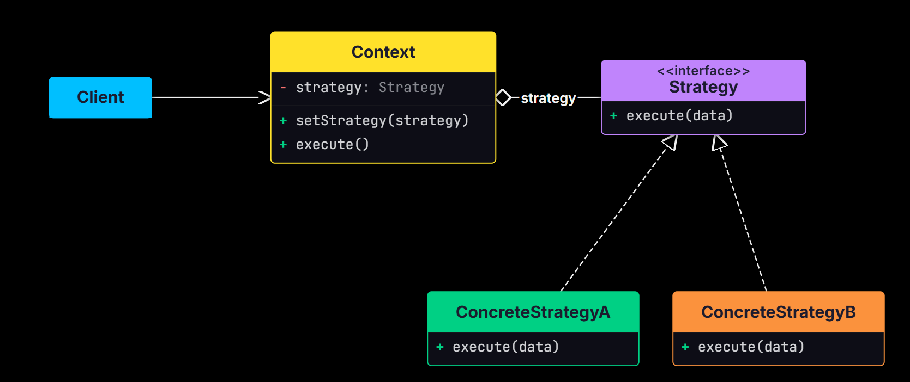
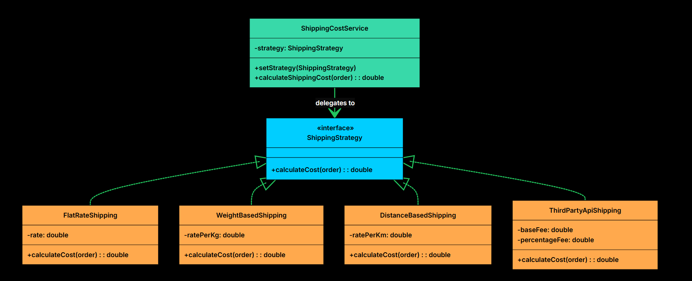

# Strategy Design Pattern

The Strategy Design Pattern is a way of organizing code so that different ways of doing the same task are kept separate and can be changed easily. Instead of putting all the possible methods inside one class and using many `if-else` or `switch` statements to decide which one to use, each method (or algorithm) is placed in its own class. 

The main idea behind the Strategy Pattern is to separate **what changes** from **what stays the same**. The overall process remains the same, but the way a specific task is performed can vary. 

This pattern becomes valuable when:

- You have multiple ways to perform the same operation, and the choice might change at runtime
- You want to avoid bloated conditional statements that select between different behaviors
- You need to isolate algorithm-specific data and logic from the code that uses it
- Different clients might need different algorithms for the same task


## The Problem: Shipping Cost Calculation

Imagine you are building an e-commerce platform. One of the features you need is a shipping cost calculator. Sounds simple enough, but shipping costs can be calculated in many different ways depending on business rules:

- **Flat Rate**: A fixed fee regardless of weight or distance
- **Weight-Based**: Cost increases with package weight
- **Distance-Based**: Different rates for different delivery zones
- **Express Delivery**: Premium pricing for faster service
- **Third-Party API**: Dynamic rates from carriers like FedEx or UPS

<details>
<summary>Python</summary>

```python
class ShippingCostCalculatorNaive:
    def calculate_shipping_cost(self, order, strategy_type):
        cost = 0.0
        
        if strategy_type.upper() == "FLAT_RATE":
            print("Calculating with Flat Rate strategy.")
            cost = 10.0
        
        elif strategy_type.upper() == "WEIGHT_BASED":
            print("Calculating with Weight-Based strategy.")
            cost = order.get_total_weight() * 2.5
        
        elif strategy_type.upper() == "DISTANCE_BASED":
            print("Calculating with Distance-Based strategy.")
            if order.get_destination_zone() == "ZoneA":
                cost = 5.0
            elif order.get_destination_zone() == "ZoneB":
                cost = 12.0
            else:
                cost = 20.0  # fallback
        
        elif strategy_type.upper() == "THIRD_PARTY_API":
            print("Calculating with Third-Party API strategy.")
            # Simulated external call
            cost = 7.5 + (order.get_order_value() * 0.02)
        
        else:
            raise ValueError(f"Unknown shipping strategy: {strategy_type}")
        
        print(f"Calculated Shipping Cost: ${cost}")
        return cost

## Client Code Using It


def ecommerce_app_v1():
    calculator = ShippingCostCalculatorNaive()
    order1 = Order()
    
    print("--- Order 1 ---")
    calculator.calculate_shipping_cost(order1, "FLAT_RATE")
    calculator.calculate_shipping_cost(order1, "WEIGHT_BASED")
    calculator.calculate_shipping_cost(order1, "DISTANCE_BASED")
    calculator.calculate_shipping_cost(order1, "THIRD_PARTY_API")
    
    # What if we want to try a new "PremiumZone" strategy?
    # We have to go modify this calculator class again...

if __name__ == "__main__":
    print("=== Naive Approach ===")
    ecommerce_app_v1()
```

</details>

<details>
<summary>C++</summary>

```cpp

class ShippingCostCalculatorNaive {
public:
    double calculateShippingCost(const Order& order, const string& strategyType) {
        double cost = 0.0;
        
        if (strategyType == "FLAT_RATE") {
            cout << "Calculating with Flat Rate strategy." << endl;
            cost = 10.0;
        }
        else if (strategyType == "WEIGHT_BASED") {
            cout << "Calculating with Weight-Based strategy." << endl;
            cost = order.getTotalWeight() * 2.5;
        }
        else if (strategyType == "DISTANCE_BASED") {
            cout << "Calculating with Distance-Based strategy." << endl;
            if (order.getDestinationZone() == "ZoneA") {
                cost = 5.0;
            } else if (order.getDestinationZone() == "ZoneB") {
                cost = 12.0;
            } else {
                cost = 20.0; // fallback
            }
        }
        else if (strategyType == "THIRD_PARTY_API") {
            cout << "Calculating with Third-Party API strategy." << endl;
            // Simulated external call
            cost = 7.5 + (order.getOrderValue() * 0.02);
        }
        else {
            throw invalid_argument("Unknown shipping strategy: " + strategyType);
        }
        
        cout << "Calculated Shipping Cost: $" << cost << endl;
        return cost;
    }
};

// Client Code Using It

void ecommerceAppV1() {
    ShippingCostCalculatorNaive calculator;
    Order order1;
    
    cout << "--- Order 1 ---" << endl;
    calculator.calculateShippingCost(order1, "FLAT_RATE");
    calculator.calculateShippingCost(order1, "WEIGHT_BASED");
    calculator.calculateShippingCost(order1, "DISTANCE_BASED");
    calculator.calculateShippingCost(order1, "THIRD_PARTY_API");
    
    // What if we want to try a new "PremiumZone" strategy?
    // We have to go modify this calculator class again...
}

int main() {
    cout << "=== Naive Approach ===" << endl;
    ecommerceAppV1();
        
    return 0;
}


```

</details>
<br/>

### What's Wrong with This Approach?

1. **Violates the Open/Closed Principle**: Every new shipping method requires modifying the `ShippingCalculator` class.

2. **Bloated Conditional Logic** :  The if-else chain becomes increasingly large and unreadable as more strategies are introduced.


3. **Difficult to Test in Isolation**: Each strategy is tangled inside one method, making it harder to test individual behaviors independently.

4. **Risk of Code Duplication**: What if another part of your application needs shipping calculations? You might copy this logic, and now you have two places to maintain.

5. **Low Cohesion**: The calculator class is doing too much. It knows how to handle every possible algorithm for shipping cost, rather than focusing on orchestrating the calculation.

### What We Really Need
We need an approach where:

- Each shipping algorithm lives in its own class
- Adding a new algorithm does not require modifying existing classes
- The calculator does not need to know which algorithm it is using
- Algorithms can be swapped at runtime based on user preferences or business rules
- Each algorithm can be tested independently


## Understanding the Strategy Pattern

**1. Encapsulation of algorithms**. This means that each algorithm is stored in its own class, and all the logic related to that algorithm stays inside that class.


**2. Runtime interchangeability**. The main class, known as the context, does not depend on a specific algorithm. Instead, it stores a reference to a common strategy interface. At runtime, the context can use any strategy that implements this interface, and the strategy can be changed whenever needed without modifying the context's code.




**Strategy Interface (e.g., `ShippingStrategy`)**  
Declares the interface common to all supported algorithms. The Context uses this interface to call the algorithm defined by a ConcreteStrategy.

**Concrete Strategies (e.g., `FlatRateShipping`, `WeightBasedShipping`)**   
Implements the algorithm using the Strategy interface. Each concrete strategy encapsulates a specific algorithm.

**Context Class (e.g., `ShippingCostService`)**
This is the main class that **uses a strategy** to perform a task. It holds a reference to a `Strategy` object and delegates the calculation to it. The context doesn’t know or care which specific strategy is being used. It just knows that it has a strategy that can calculate a shipping cost.


## Implementing the Strategy Pattern




<details>
<summary>Python</summary>

```python

## Step 1: Define the Strategy Interface (ShippingStrategy)
from abc import ABC, abstractmethod

class ShippingStrategy(ABC):
    @abstractmethod
    def calculate_cost(self, order) -> float:
        pass


## Step 2: Implement Concrete Strategies

class FlatRateShipping(ShippingStrategy):
    def __init__(self, rate):
        self.rate = rate
    
    def calculate_cost(self, order):
        print(f"Calculating with Flat Rate strategy (${self.rate})")
        return self.rate

class WeightBasedShipping(ShippingStrategy):
    def __init__(self, rate_per_kg):
        self.rate_per_kg = rate_per_kg
    
    def calculate_cost(self, order):
        print(f"Calculating with Weight-Based strategy (${self.rate_per_kg}/kg)")
        return order.get_total_weight() * self.rate_per_kg

class DistanceBasedShipping(ShippingStrategy):
    def __init__(self, rate_per_km):
        self.rate_per_km = rate_per_km
    
    def calculate_cost(self, order):
        print(f"Calculating with Distance-Based strategy for zone: {order.get_destination_zone()}")
        zone_mapping = {
            "ZoneA": self.rate_per_km * 5.0,
            "ZoneB": self.rate_per_km * 7.0
        }
        return zone_mapping.get(order.get_destination_zone(), self.rate_per_km * 10.0)

class ThirdPartyApiShipping(ShippingStrategy):
    def __init__(self, base_fee, percentage_fee):
        self.base_fee = base_fee
        self.percentage_fee = percentage_fee
    
    def calculate_cost(self, order):
        print("Calculating with Third-Party API strategy.")
        # Simulate API call
        return self.base_fee + (order.get_order_value() * self.percentage_fee)

## Step 3: Create the Context Class

class ShippingCostService:
    def __init__(self, strategy: ShippingStrategy):
        self.strategy = strategy
    
    def set_strategy(self, strategy: ShippingStrategy):
        print(f"ShippingCostService: Strategy changed to {strategy.__class__.__name__}")
        self.strategy = strategy
    
    def calculate_shipping_cost(self, order):
        if self.strategy is None:
            raise ValueError("Shipping strategy not set.")
        
        cost = self.strategy.calculate_cost(order)
        print(f"ShippingCostService: Final Calculated Shipping Cost: ${cost} "
              f"(using {self.strategy.__class__.__name__})")
        return cost

## Step 4: Client Code

def ecommerce_app_v2():
    order1 = Order()
    
    # Create different strategy instances
    flat_rate = FlatRateShipping(10.0)
    weight_based = WeightBasedShipping(2.5)
    distance_based = DistanceBasedShipping(5.0)
    third_party = ThirdPartyApiShipping(7.5, 0.02)
    
    # Create context with an initial strategy
    shipping_service = ShippingCostService(flat_rate)
    
    print("--- Order 1: Using Flat Rate (initial) ---")
    shipping_service.calculate_shipping_cost(order1)
    
    print("\n--- Order 1: Changing to Weight-Based ---")
    shipping_service.set_strategy(weight_based)
    shipping_service.calculate_shipping_cost(order1)
    
    print("\n--- Order 1: Changing to Distance-Based ---")
    shipping_service.set_strategy(distance_based)
    shipping_service.calculate_shipping_cost(order1)
    
    print("\n--- Order 1: Changing to Third-Party API ---")
    shipping_service.set_strategy(third_party)
    shipping_service.calculate_shipping_cost(order1)
    

# Example usage
if __name__ == "__main__":
    ecommerce_app_v2()


```

</details>

<details>
<summary>C++</summary>

```cpp

// Step 1: Define the Strategy Interface (ShippingStrategy)

class ShippingStrategy {
public:
    virtual ~ShippingStrategy() {}
    virtual double calculateCost(const Order& order) = 0;
};

// Step 2: Implement Concrete Strategies

class FlatRateShipping : public ShippingStrategy {
private:
    double rate;

public:
    FlatRateShipping(double r) : rate(r) {}
    
    double calculateCost(const Order& order) override {
        cout << "Calculating with Flat Rate strategy ($" << rate << ")" << endl;
        return rate;
    }
};


class WeightBasedShipping : public ShippingStrategy {
private:
    double ratePerKg;

public:
    WeightBasedShipping(double rateKg) : ratePerKg(rateKg) {}
    
    double calculateCost(const Order& order) override {
        cout << "Calculating with Weight-Based strategy ($" << ratePerKg << "/kg)" << endl;
        return order.getTotalWeight() * ratePerKg;
    }
};

class DistanceBasedShipping : public ShippingStrategy {
private:
    double ratePerKm;

public:
    DistanceBasedShipping(double rateKm) : ratePerKm(rateKm) {}
    
    double calculateCost(const Order& order) override {
        cout << "Calculating with Distance-Based strategy for zone: " << order.getDestinationZone() << endl;
        
        if (order.getDestinationZone() == "ZoneA") {
            return ratePerKm * 5.0;
        } else if (order.getDestinationZone() == "ZoneB") {
            return ratePerKm * 7.0;
        } else {
            return ratePerKm * 10.0;
        }
    }
};


class ThirdPartyApiShipping : public ShippingStrategy {
private:
    double baseFee;
    double percentageFee;

public:
    ThirdPartyApiShipping(double base, double percentage) 
        : baseFee(base), percentageFee(percentage) {}
    
    double calculateCost(const Order& order) override {
        cout << "Calculating with Third-Party API strategy." << endl;
        // Simulate API call
        return baseFee + (order.getOrderValue() * percentageFee);
    }
};

// Step 3: Create the Context Class

class ShippingCostService {
private:
    ShippingStrategy* strategy;

public:
    ShippingCostService(ShippingStrategy* s) : strategy(s) {}
    
    void setStrategy(ShippingStrategy* s) {
        cout << "ShippingCostService: Strategy changed" << endl;
        strategy = s;
    }
    
    double calculateShippingCost(const Order& order) {
        if (strategy == nullptr) {
            throw invalid_argument("Shipping strategy not set.");
        }
        
        double cost = strategy->calculateCost(order);
        cout << "ShippingCostService: Final Calculated Shipping Cost: $" << cost << endl;
        return cost;
    }
};

// Step 4: Client Code


void ecommerceAppV2() {
    Order order1;
    
    // Create different strategy instances
    FlatRateShipping flatRate(10.0);
    WeightBasedShipping weightBased(2.5);
    DistanceBasedShipping distanceBased(5.0);
    ThirdPartyApiShipping thirdParty(7.5, 0.02);
    
    // Create context with an initial strategy
    ShippingCostService shippingService(&flatRate);
    
    cout << "--- Order 1: Using Flat Rate (initial) ---" << endl;
    shippingService.calculateShippingCost(order1);
    
    cout << "\n--- Order 1: Changing to Weight-Based ---" << endl;
    shippingService.setStrategy(&weightBased);
    shippingService.calculateShippingCost(order1);
    
    cout << "\n--- Order 1: Changing to Distance-Based ---" << endl;
    shippingService.setStrategy(&distanceBased);
    shippingService.calculateShippingCost(order1);
    
    cout << "\n--- Order 1: Changing to Third-Party API ---" << endl;
    shippingService.setStrategy(&thirdParty);
    shippingService.calculateShippingCost(order1);
}

int main() {
    cout << "\n\n=== Strategy Pattern Approach ===" << endl;
    ecommerceAppV2();
    return 0;
}

```

</details>
<br/>

