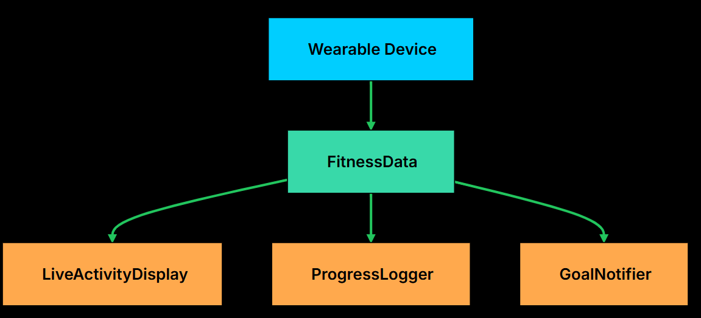
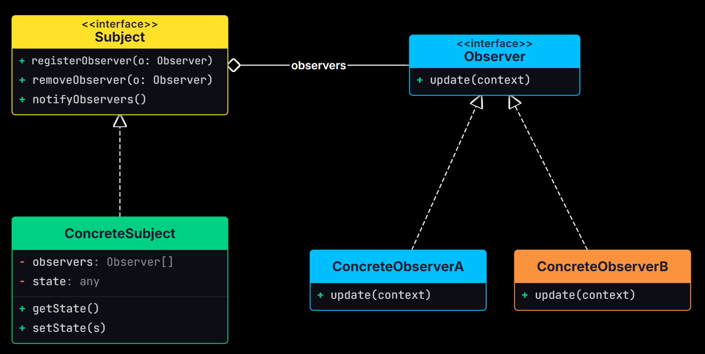

# Observer Design Pattern 

The Observer Design Pattern is a behavioral design pattern that defines a one-to-many relationship between objects, where one object, called the **Subject** (or Publisher), automatically notifies all its dependent objects, called **Observers** (or Subscribers), whenever its state changes. 

Instead of tightly coupling objects together, the Observer pattern allows observers to register (subscribe) or unregister (unsubscribe) themselves from the subject dynamically. This promotes loose coupling, making the system more flexible, maintainable, and scalable. 

The pattern is commonly used in **event-driven systems** such as GUI applications, notification services, stock market applications, and messaging systems, where multiple objects need to stay updated whenever a particular object's data changes without the subject needing to know the details of its observers.

This pattern shines in scenarios where:


- You have multiple parts of the system that need to react to a change in one central component.

- You need a dynamic, event-driven communication model without hardcoding who is listening to whom.


## The Problem: Broadcasting Fitness Data

Imagine you are building a Fitness Tracker App that connects to a wearable device. The device continuously streams real-time fitness data: steps taken, active minutes, and calories burned. This data flows into a central **FitnessData** object.


Now, multiple modules within your app need to react to these updates:




### The Naive Approach

<details>
<summary>Python</summary>

```python

class FitnessDataNaive:
    def __init__(self):
        self.steps = 0
        self.active_minutes = 0
        self.calories = 0
        
        # Direct, hardcoded references to all dependent modules
        self.live_display = LiveActivityDisplayNaive()
        self.progress_logger = ProgressLoggerNaive()
        self.notification_service = NotificationServiceNaive()
    
    def new_fitness_data_pushed(self, new_steps, new_active_minutes, new_calories):
        self.steps = new_steps
        self.active_minutes = new_active_minutes
        self.calories = new_calories
        
        print(f"\nFitnessDataNaive: New data received - Steps: {self.steps}, "
              f"ActiveMins: {self.active_minutes}, Calories: {self.calories}")
        
        # Manually notify each dependent module
        self.live_display.show_stats(self.steps, self.active_minutes, self.calories)
        self.progress_logger.log_data_point(self.steps, self.active_minutes, self.calories)
        self.notification_service.check_and_notify(self.steps)
    
    def daily_reset(self):
        # Reset logic...
        if self.notification_service is not None:
            self.notification_service.reset_daily_notifications()
        print("FitnessDataNaive: Daily data reset.")
        self.new_fitness_data_pushed(0, 0, 0)  # Notify with reset state

## Here is how the client uses the naive approach:

def fitness_app_naive_client():
    fitness_data = FitnessDataNaive()

    fitness_data.new_fitness_data_pushed(500, 5, 20)
    fitness_data.new_fitness_data_pushed(9800, 85, 350)
    fitness_data.new_fitness_data_pushed(10100, 90, 380)
    fitness_data.daily_reset()

if __name__ == "__main__":
    fitness_app_naive_client()

```

</details>

<details>
<summary>C++</summary>

```cpp

class FitnessDataNaive {
private:
    int steps;
    int activeMinutes;
    int calories;
    
    // Direct, hardcoded references to all dependent modules
    LiveActivityDisplayNaive liveDisplay;
    ProgressLoggerNaive progressLogger;
    NotificationServiceNaive notificationService;

public:
    FitnessDataNaive() : steps(0), activeMinutes(0), calories(0) {}
    
    void newFitnessDataPushed(int newSteps, int newActiveMinutes, int newCalories) {
        steps = newSteps;
        activeMinutes = newActiveMinutes;
        calories = newCalories;
        
        cout << "\nFitnessDataNaive: New data received - Steps: " << steps 
             << ", ActiveMins: " << activeMinutes << ", Calories: " << calories << endl;
        
        // Manually notify each dependent module
        liveDisplay.showStats(steps, activeMinutes, calories);
        progressLogger.logDataPoint(steps, activeMinutes, calories);
        notificationService.checkAndNotify(steps);
    }
    
    void dailyReset() {
        // Reset logic...
        notificationService.resetDailyNotifications();
        cout << "FitnessDataNaive: Daily data reset." << endl;
        newFitnessDataPushed(0, 0, 0); // Notify with reset state
    }
};

// Here is how the client uses the naive approach:


int main() {
    FitnessDataNaive fitnessData;

    fitnessData.newFitnessDataPushed(500, 5, 20);
    fitnessData.newFitnessDataPushed(9800, 85, 350);
    fitnessData.newFitnessDataPushed(10100, 90, 380);
    fitnessData.dailyReset();

    return 0;
}

```

</details>
<br/>


### Problems with This Approach

**1. Tight Coupling**

`FitnessData` holds direct references to `LiveActivityDisplay`, `ProgressLogger`, and `NotificationService`. It knows their concrete types, their method signatures, and their construction logic.


If any of these classes change their interface, or if you want to replace one with a different implementation, you must modify `FitnessData`.


**2. Violates the Open/Closed Principle**:

What happens when you want to add a WeeklySummaryGenerator? Or a SocialSharingService that posts achievements to social media?

Each new feature requires you to:

- Add a new field to FitnessData
- Modify the `newFitnessDataPushed()` method
- Potentially update the constructor

**3. Inflexible and Static Design**


Modules like the NotificationService or ProgressLogger can’t be added or removed at runtime. What if the user disables notifications in their settings?

You will need to add conditionals to manually enable/disable parts of the code, making things fragile and error-prone.

**4. Responsibility Bloat**

FitnessData should have one job: managing fitness metrics. 

##  Understanding the Observer Pattern

Two characteristics define the pattern:


1. **One-to-many notification**. A single subject can have any number of observers. When the subject's state changes, it iterates through its list of observers and calls an update method on each one. The subject does not know what the observers do with the information. It just sends the signal.

2. **Loose coupling between subject and observers.** The subject depends only on the observer interface, not on any concrete observer class. Observers can be added, removed, or replaced at runtime without modifying the subject. This means the subject and observers can vary independently.


## Class Digram 



**1. Subject Interface**

Declares the interface for managing observers, registering, removing, and notifying them. Defines registerObserver(), removeObserver(), and notifyObservers() methods.

The subject holds a list of observers typed to the Observer interface, not to concrete classes. This means any class that implements the Observer interface can register, and the subject never needs to know what it is.

**2. Observer Interface**

Declares the update() method that the subject calls when its state changes. All modules that want to listen to fitness data changes will implement this interface.

**3. ConcreteSubject (e.g., FitnessData)**

Implements the Subject interface. Holds the actual state and notifies observers when that state changes.

Maintain a list of registered observers and calls notifyObservers() whenever its state changes.

**4. ConcreteObservers (e.g., LiveActivityDisplay)**

Implements the Observer interface. Defines what happens when the subject's state changes. When update() is called, each observer pulls relevant data from the subject and performs its own logic (e.g., update UI, log progress, send alerts).


## Implementing Observer Pattern

<details>
<summary>Python</summary>

```python

## Step 1: Define the Observer Interface
from abc import ABC, abstractmethod

class FitnessDataObserver(ABC):
    @abstractmethod
    def update(self, data):
        pass


## Step 2: Define the Subject Interface

class FitnessDataSubject(ABC):
    @abstractmethod
    def register_observer(self, observer):
        pass
    
    @abstractmethod
    def remove_observer(self, observer):
        pass
    
    @abstractmethod
    def notify_observers(self):
        pass

## Step 3: Implement the ConcreteSubject
class FitnessData(FitnessDataSubject):
    def __init__(self):
        self.steps = 0
        self.active_minutes = 0
        self.calories = 0
        self.observers = []
    
    def register_observer(self, observer: FitnessDataObserver):
        self.observers.append(observer)
    
    def remove_observer(self, observer: FitnessDataObserver):
        if observer in self.observers:
            self.observers.remove(observer)
    
    def notify_observers(self):
        for observer in self.observers:
            ### passing self / this
            observer.update(self)
    
    def new_fitness_data_pushed(self, steps, active_minutes, calories):
        self.steps = steps
        self.active_minutes = active_minutes
        self.calories = calories
        
        print(f"\nFitnessData: New data received – Steps: {steps}, "
              f"Active Minutes: {active_minutes}, Calories: {calories}")
        
        self.notify_observers()
    
    def daily_reset(self):
        self.steps = 0
        self.active_minutes = 0
        self.calories = 0
        
        print("\nFitnessData: Daily reset performed.")
        self.notify_observers()
    
    # Getters
    def get_steps(self):
        return self.steps
    
    def get_active_minutes(self):
        return self.active_minutes
    
    def get_calories(self):
        return self.calories

## Step 4: Implement Concrete Observers

class LiveActivityDisplay(FitnessDataObserver):
    def update(self, data):
        print(f"Live Display → Steps: {data.get_steps()} "
              f"| Active Minutes: {data.get_active_minutes()} "
              f"| Calories: {data.get_calories()}")

class ProgressLogger(FitnessDataObserver):
    def update(self, data):
        print(f"Logger → Saving to DB: Steps={data.get_steps()}, "
              f"ActiveMinutes={data.get_active_minutes()}, "
              f"Calories={data.get_calories()}")
        # Simulated DB/file write...


class GoalNotifier(FitnessDataObserver):
    def __init__(self):
        self.step_goal = 10000
        self.goal_reached = False
    
    def update(self, data):
        if data.get_steps() >= self.step_goal and not self.goal_reached:
            print(f"Notifier → 🎉 Goal Reached! You've hit {self.step_goal} steps!")
            self.goal_reached = True
    
    def reset(self):
        self.goal_reached = False

## Step 5: Client Code
def fitness_app_observer_demo():
    fitness_data = FitnessData()

    display = LiveActivityDisplay()
    logger = ProgressLogger()
    notifier = GoalNotifier()

    # Register observers
    fitness_data.register_observer(display)
    fitness_data.register_observer(logger)
    fitness_data.register_observer(notifier)

    # Simulate updates
    fitness_data.new_fitness_data_pushed(500, 5, 20)
    fitness_data.new_fitness_data_pushed(9800, 85, 350)
    fitness_data.new_fitness_data_pushed(10100, 90, 380)

    # Remove logger and reset notifier
    fitness_data.remove_observer(logger)
    notifier.reset()
    fitness_data.daily_reset()

if __name__ == "__main__":
    print("=== Observer Pattern Approach ===")
    fitness_app_observer_demo()

```

</details>

<details>
<summary>C++</summary>

```cpp

// Step 1: Define the Observer Interface

class FitnessDataObserver {
public:
    virtual ~FitnessDataObserver() {}
    virtual void update(FitnessData* data) = 0;
};


// Step 2: Define the Subject Interface

class FitnessDataSubject {
public:
    virtual ~FitnessDataSubject() {}
    virtual void registerObserver(FitnessDataObserver* observer) = 0;
    virtual void removeObserver(FitnessDataObserver* observer) = 0;
    virtual void notifyObservers() = 0;
};

// Step 3: Implement the ConcreteSubject

class FitnessData : public FitnessDataSubject {
private:
    int steps;
    int activeMinutes;
    int calories;
    vector<FitnessDataObserver*> observers;

public:
    FitnessData() : steps(0), activeMinutes(0), calories(0) {}
    
    void registerObserver(FitnessDataObserver* observer) override {
        observers.push_back(observer);
    }
    
    void removeObserver(FitnessDataObserver* observer) override {
        observers.erase(remove(observers.begin(), observers.end(), observer), observers.end());
    }
    
    void notifyObservers() override {
        for (FitnessDataObserver* observer : observers) {
            observer->update(this);
        }
    }
    
    void newFitnessDataPushed(int newSteps, int newActiveMinutes, int newCalories) {
        steps = newSteps;
        activeMinutes = newActiveMinutes;
        calories = newCalories;
        
        cout << "\nFitnessData: New data received – Steps: " << steps 
             << ", Active Minutes: " << activeMinutes << ", Calories: " << calories << endl;
        
        notifyObservers();
    }
    
    void dailyReset() {
        steps = 0;
        activeMinutes = 0;
        calories = 0;
        
        cout << "\nFitnessData: Daily reset performed." << endl;
        notifyObservers();
    }
    
    // Getters
    int getSteps() const { return steps; }
    int getActiveMinutes() const { return activeMinutes; }
    int getCalories() const { return calories; }
};

// Step 4: Implement Concrete Observers

class LiveActivityDisplay : public FitnessDataObserver {
public:
    void update(FitnessData* data) override {
        cout << "Live Display → Steps: " << data->getSteps() 
             << " | Active Minutes: " << data->getActiveMinutes() 
             << " | Calories: " << data->getCalories() << endl;
    }
};

class ProgressLogger : public FitnessDataObserver {
public:
    void update(FitnessData* data) override {
        cout << "Logger → Saving to DB: Steps=" << data->getSteps() 
             << ", ActiveMinutes=" << data->getActiveMinutes() 
             << ", Calories=" << data->getCalories() << endl;
        // Simulated DB/file write...
    }
};

class GoalNotifier : public FitnessDataObserver {
private:
    int stepGoal;
    bool goalReached;

public:
    GoalNotifier() : stepGoal(10000), goalReached(false) {}
    
    void update(FitnessData* data) override {
        if (data->getSteps() >= stepGoal && !goalReached) {
            cout << "Notifier → 🎉 Goal Reached! You've hit " << stepGoal << " steps!" << endl;
            goalReached = true;
        }
    }
    
    void reset() {
        goalReached = false;
    }
};

// Step 5: Client Code

int main() {
    cout << "=== Observer Pattern Approach ===" << endl;

    FitnessData fitnessData;

    LiveActivityDisplay display;
    ProgressLogger logger;
    GoalNotifier notifier;

    // Register observers
    fitnessData.registerObserver(&display);
    fitnessData.registerObserver(&logger);
    fitnessData.registerObserver(&notifier);

    // Simulate updates
    fitnessData.newFitnessDataPushed(500, 5, 20);
    fitnessData.newFitnessDataPushed(9800, 85, 350);
    fitnessData.newFitnessDataPushed(10100, 90, 380);

    // Remove logger and reset notifier
    fitnessData.removeObserver(&logger);
    notifier.reset();
    fitnessData.dailyReset();

    return 0;
}

```

</details>
<br/>


### What We Achieved

- Loose coupling. `FitnessData` does not know who is listening. It just broadcasts to a list of interfaces.

- Open/Closed compliance. Adding a new module only requires implementing `FitnessDataObserver` and calling `registerObserver()`. Zero changes to `FitnessData`.


......