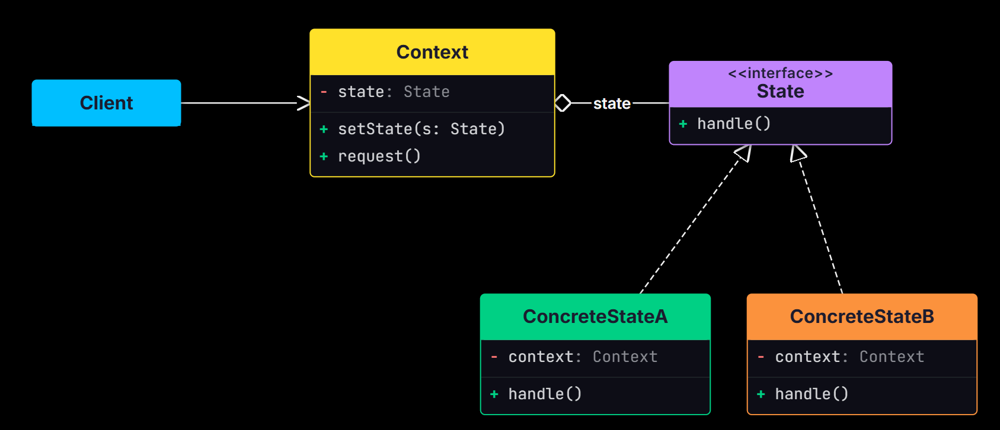
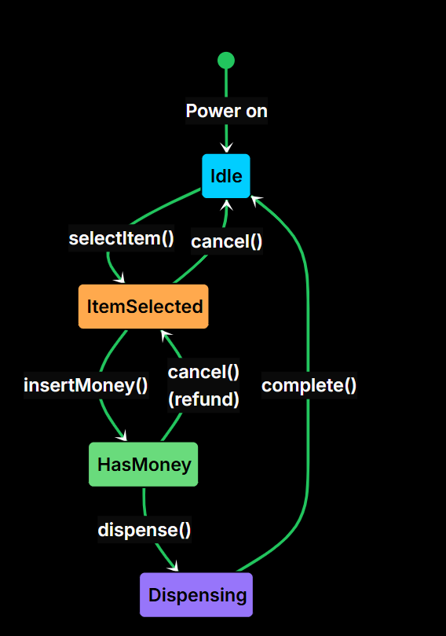
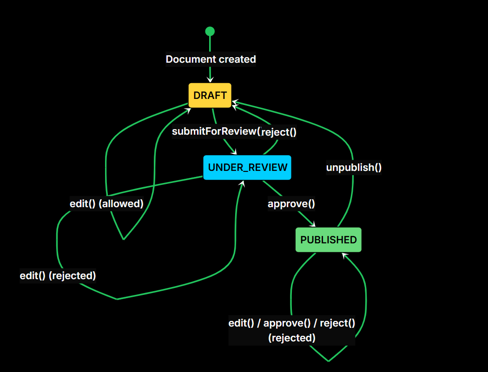

# State Design Pattern

**The State Design Pattern is a behavioral design pattern that lets an object change its behavior when its internal state changes, as if it were switching to a different class at runtime.**


It’s particularly useful in situations where:

- An object can be in one of many distinct states, each with different behavior.
- The object’s behavior depends on current context, and that context changes over time.
- You want to avoid large, monolithic if-else or switch statements that check for every possible state.

## The Problem: Managing Vending Machine States

Imagine you're building a simple **vending machine system**. On the surface, it seems straightforward: accept money, dispense products, and go back to idle.

But the tricky part is that the machine’s behavior must change depending on what’s happening right now. A vending machine can be in only one state at a time, for example:

- **IdleState**: Waiting for user input (nothing selected, no money inserted).

- **ItemSelectedState**: An item has been selected, waiting for payment.

- **HasMoneyState**: Money has been inserted, waiting to dispense the selected item.

- **DispensingState**: The machine is actively dispensing the item.

The machine supports a few user-facing operations:


- `selectItem(String itemCode)` – Select an item to purchase

- `insertCoin(double amount)` – Insert payment for the selected item

- `dispenseItem()` – Trigger the item dispensing process

Each of these methods should behave differently based on the machine's current state.

For example, calling `dispenseItem()` while the machine is in `IdleState` should do nothing or show an error.

### The Naive Approach


<details>
<summary>Python</summary>

```python
from enum import Enum

class State(Enum):
    IDLE = 1
    ITEM_SELECTED = 2
    HAS_MONEY = 3
    DISPENSING = 4


class VendingMachine:
    def __init__(self):
        self.current_state = State.IDLE
        self.selected_item = ""
        self.inserted_amount = 0.0

    def select_item(self, item_code):
        if self.current_state == State.IDLE:
            self.selected_item = item_code
            self.current_state = State.ITEM_SELECTED
        elif self.current_state == State.ITEM_SELECTED:
            print("Item already selected")
        elif self.current_state == State.HAS_MONEY:
            print("Payment already received for item")
        elif self.current_state == State.DISPENSING:
            print("Currently dispensing")

    def insert_coin(self, amount):
        if self.current_state == State.IDLE:
            print("No item selected")
        elif self.current_state == State.ITEM_SELECTED:
            self.inserted_amount = amount
            print(f"Inserted ${amount} for item")
            self.current_state = State.HAS_MONEY
        elif self.current_state == State.HAS_MONEY:
            print("Money already inserted")
        elif self.current_state == State.DISPENSING:
            print("Currently dispensing")

    def dispense_item(self):
        if self.current_state == State.IDLE:
            print("No item selected")
        elif self.current_state == State.ITEM_SELECTED:
            print("Please insert coin first")
        elif self.current_state == State.HAS_MONEY:
            print(f"Dispensing item '{self.selected_item}'")
            self.current_state = State.DISPENSING
            print("Item dispensed successfully.")
            self._reset_machine()
        elif self.current_state == State.DISPENSING:
            print("Already dispensing. Please wait.")

    def _reset_machine(self):
        self.selected_item = ""
        self.inserted_amount = 0.0
        self.current_state = State.IDLE

```

</details>

<details>
<summary>C++</summary>

```cpp

enum State {
    IDLE, ITEM_SELECTED, HAS_MONEY, DISPENSING
};

class VendingMachine {
private:
    State currentState;
    string selectedItem;
    double insertedAmount;

public:
    VendingMachine() : currentState(IDLE), selectedItem(""), insertedAmount(0.0) {}

    void selectItem(string itemCode) {
        switch (currentState) {
            case IDLE:
                selectedItem = itemCode;
                currentState = ITEM_SELECTED;
                break;
            case ITEM_SELECTED:
                cout << "Item already selected" << endl;
                break;
            case HAS_MONEY:
                cout << "Payment already received for item" << endl;
                break;
            case DISPENSING:
                cout << "Currently dispensing" << endl;
                break;
        }
    }

    void insertCoin(double amount) {
        switch (currentState) {
            case IDLE:
                cout << "No item selected" << endl;
                break;
            case ITEM_SELECTED:
                insertedAmount = amount;
                cout << "Inserted $" << amount << " for item" << endl;
                currentState = HAS_MONEY;
                break;
            case HAS_MONEY:
                cout << "Money already inserted" << endl;
                break;
            case DISPENSING:
                cout << "Currently dispensing" << endl;
                break;
        }
    }

    void dispenseItem() {
        switch (currentState) {
            case IDLE:
                cout << "No item selected" << endl;
                break;
            case ITEM_SELECTED:
                cout << "Please insert coin first" << endl;
                break;
            case HAS_MONEY:
                cout << "Dispensing item '" << selectedItem << "'" << endl;
                currentState = DISPENSING;
                cout << "Item dispensed successfully." << endl;
                resetMachine();
                break;
            case DISPENSING:
                cout << "Already dispensing. Please wait." << endl;
                break;
        }
    }

    void resetMachine() {
        selectedItem = "";
        insertedAmount = 0.0;
        currentState = IDLE;
    }
};

```

</details>
<br/>


### What's Wrong with This Approach?
While using an enum with switch statements can work for small, predictable systems, this approach doesn't scale well.

**1. Cluttered Code** : All state-related logic is stuffed into a single class (`VendingMachine`), resulting in large and repetitive `switch` or `if-else` blocks across every method.

**2. Hard to Extend** : Suppose you want to introduce new states like OutOfStockState (when the selected item is sold out) or MaintenanceState (when the machine is undergoing service). To support these, you would need to update every switch block in every method,etc.

**3. Violates the Single Responsibility Principle**: The `VendingMachine` class is now responsible for managing state transitions, implementing business rules, and executing state-specific logic. This tight coupling makes the class monolithic, hard to test, and resistant to change.

## The State Pattern
Two characteristics define the pattern:

- **Encapsulation of state-specific behavior**: Each state gets its own class. All the logic for "what happens when the machine is idle and someone inserts a coin" lives in the IdleState class, not buried in a switch statement somewhere.

- **State-driven transitions**: Each state object is responsible for deciding when and how to move to the next state. Instead of the context using if-else or switch statements to determine the next state, it simply delegates the request to the current state. The current state performs its behavior and updates the context to the appropriate next state, making the code cleaner, more organized, and easier to extend.





**State interface (like MachineState)** defines all the actions a system can perform. Every state must implement these actions, even if some do nothing in a particular state. It also receives the context as a parameter so it can change the current state when needed.

**Concrete States (like IdleState or ItemSelectedState)** provide the actual behavior for each action based on the current state. If an action should move the system to another state, the concrete state updates the context by setting a new state.

**Context (like VendingMachine)** is the main class that users interact with. It keeps track of the current state and forwards every request to that state object, allowing the system's behavior to change automatically depending on its current state.


## Implementing State Pattern

### State Diagram





<details>
<summary>Python</summary>

```python

## Step 1: Define the State Interface

from abc import ABC, abstractmethod

class MachineState(ABC):
    @abstractmethod
    def select_item(self, context: VendingMachine, item_code):
        pass

    @abstractmethod
    def insert_coin(self, context:VendingMachine, amount):
        pass

    @abstractmethod
    def dispense_item(self, context: VendingMachine):
        pass

## Step 2: Implement Concrete State Classes

class IdleState(MachineState):
    def select_item(self, context:VendingMachine, item_code):
        print(f"Item selected: {item_code}")
        context.set_selected_item(item_code)
        context.set_state(ItemSelectedState())

    def insert_coin(self, context:VendingMachine, amount):
        print("Please select an item before inserting coins.")

    def dispense_item(self, context:VendingMachine):
        print("No item selected. Nothing to dispense.")

class ItemSelectedState(MachineState):
    def select_item(self, context, item_code):
        print(f"Item already selected: {context.get_selected_item()}")

    def insert_coin(self, context, amount):
        print(f"Inserted ${amount} for item: {context.get_selected_item()}")
        context.set_inserted_amount(amount)
        context.set_state(HasMoneyState())

    def dispense_item(self, context):
        print("Insert coin before dispensing.")

class HasMoneyState(MachineState):
    def select_item(self, context, item_code):
        print("Cannot change item after inserting money.")

    def insert_coin(self, context, amount):
        print("Money already inserted.")

    def dispense_item(self, context):
        print(f"Dispensing item: {context.get_selected_item()}")
        context.set_state(DispensingState())
        print("Item dispensed successfully.")
        context.reset()

class DispensingState(MachineState):
    def select_item(self, context, item_code):
        print("Please wait, dispensing in progress.")

    def insert_coin(self, context, amount):
        print("Please wait, dispensing in progress.")

    def dispense_item(self, context):
        print("Already dispensing. Please wait.")

## Step 3: Implement the Context (VendingMachine)


class VendingMachine:
    def __init__(self):
        self._current_state = IdleState()
        self._selected_item = ""
        self._inserted_amount = 0.0

    def set_state(self, new_state: MachineState):
        self._current_state = new_state

    def set_selected_item(self, item_code):
        self._selected_item = item_code

    def set_inserted_amount(self, amount):
        self._inserted_amount = amount

    def get_selected_item(self):
        return self._selected_item

    def select_item(self, item_code):
        self._current_state.select_item(self, item_code)

    def insert_coin(self, amount):
        self._current_state.insert_coin(self, amount)

    def dispense_item(self):
        self._current_state.dispense_item(self)

    def reset(self):
        self._selected_item = ""
        self._inserted_amount = 0.0
        self._current_state = IdleState()

## Client code
def main():
    vm = VendingMachine()

    vm.insert_coin(1.0)   # Rejected: no item selected
    vm.select_item("A1")  # Transitions to ItemSelectedState
    vm.insert_coin(1.5)   # Transitions to HasMoneyState
    vm.dispense_item()    # Dispenses, resets to IdleState

    print("\n--- Second Transaction ---")
    vm.select_item("B2")
    vm.insert_coin(2.0)
    vm.dispense_item()

if __name__ == "__main__":
    main()

```

</details>

<details>
<summary>C++</summary>

```cpp

// Step 1: Define the State Interface

class VendingMachine; // Forward declaration

class MachineState {
public:
    virtual ~MachineState() = default;
    virtual void selectItem(VendingMachine* context, string itemCode) = 0;
    virtual void insertCoin(VendingMachine* context, double amount) = 0;
    virtual void dispenseItem(VendingMachine* context) = 0;
};

// Step 2: Implement Concrete State Classes

class IdleState : public MachineState {
public:
    void selectItem(VendingMachine* context, string itemCode) override {
        cout << "Item selected: " << itemCode << endl;
        context->setSelectedItem(itemCode);
        context->setState(new ItemSelectedState());
    }

    void insertCoin(VendingMachine* context, double amount) override {
        cout << "Please select an item before inserting coins." << endl;
    }

    void dispenseItem(VendingMachine* context) override {
        cout << "No item selected. Nothing to dispense." << endl;
    }
};


class ItemSelectedState : public MachineState {
public:
    void selectItem(VendingMachine* context, string itemCode) override {
        cout << "Item already selected: " << context->getSelectedItem() << endl;
    }

    void insertCoin(VendingMachine* context, double amount) override {
        cout << "Inserted $" << amount << " for item: " << context->getSelectedItem() << endl;
        context->setInsertedAmount(amount);
        context->setState(new HasMoneyState());
    }

    void dispenseItem(VendingMachine* context) override {
        cout << "Insert coin before dispensing." << endl;
    }
};

class HasMoneyState : public MachineState {
public:
    void selectItem(VendingMachine* context, string itemCode) override {
        cout << "Cannot change item after inserting money." << endl;
    }

    void insertCoin(VendingMachine* context, double amount) override {
        cout << "Money already inserted." << endl;
    }

    void dispenseItem(VendingMachine* context) override {
        cout << "Dispensing item: " << context->getSelectedItem() << endl;
        context->setState(new DispensingState());
        cout << "Item dispensed successfully." << endl;
        context->reset();
    }
};

class DispensingState : public MachineState {
public:
    void selectItem(VendingMachine* context, string itemCode) override {
        cout << "Please wait, dispensing in progress." << endl;
    }

    void insertCoin(VendingMachine* context, double amount) override {
        cout << "Please wait, dispensing in progress." << endl;
    }

    void dispenseItem(VendingMachine* context) override {
        cout << "Already dispensing. Please wait." << endl;
    }
};

// Step 3: Implement the Context (VendingMachine)

class VendingMachine {
private:
    MachineState* currentState;
    string selectedItem;
    double insertedAmount;

public:
    VendingMachine() : selectedItem(""), insertedAmount(0.0) {
        currentState = new IdleState();
    }

    ~VendingMachine() {
        delete currentState;
    }

    void setState(MachineState* newState) {
        delete currentState;
        currentState = newState;
    }

    void setSelectedItem(string itemCode) {
		selectedItem = itemCode;
	}
    
	void setInsertedAmount(double amount) {
		insertedAmount = amount;
	}
    
	string getSelectedItem() {
		return selectedItem;
	}

    void selectItem(string itemCode) {
        currentState->selectItem(this, itemCode);
    }

    void insertCoin(double amount) {
        currentState->insertCoin(this, amount);
    }

    void dispenseItem() {
        currentState->dispenseItem(this);
    }

    void reset() {
        selectedItem = "";
        insertedAmount = 0.0;
        setState(new IdleState());
    }
};

// Client code
int main() {
    VendingMachine* vm = new VendingMachine();

    vm->insertCoin(1.0);   // Rejected: no item selected
    vm->selectItem("A1");  // Transitions to ItemSelectedState
    vm->insertCoin(1.5);   // Transitions to HasMoneyState
    vm->dispenseItem();    // Dispenses, resets to IdleState

    cout << "\n--- Second Transaction ---" << endl;
    vm->selectItem("B2");
    vm->insertCoin(2.0);
    vm->dispenseItem();

    delete vm;
    return 0;
}

```

</details>
<br/>

## Practical Example: Document Workflow
Let us work through a second example to reinforce the pattern. This time, we are building a document management system where documents move through a workflow: Draft, Under Review, and Published. Each state has different rules for what operations are allowed.

In Draft state, authors can edit the document and submit it for review. In Review state, reviewers can approve or reject it. In Published state, the document is read-only and can only be unpublished to go back to Draft.





<details>
<summary>Python</summary>

```python

from abc import ABC, abstractmethod

class DocumentState(ABC):
    @abstractmethod
    def edit(self, context, content):
        pass

    @abstractmethod
    def submit_for_review(self, context):
        pass

    @abstractmethod
    def approve(self, context):
        pass

    @abstractmethod
    def reject(self, context):
        pass

    @abstractmethod
    def unpublish(self, context):
        pass

class DraftState(DocumentState):
    def edit(self, context, content):
        print(f"Editing document: {content}")
        context.set_content(content)

    def submit_for_review(self, context):
        print("Document submitted for review.")
        context.set_state(UnderReviewState())

    def approve(self, context):
        print("Cannot approve a draft. Submit for review first.")

    def reject(self, context):
        print("Cannot reject a draft. Submit for review first.")

    def unpublish(self, context):
        print("Document is already a draft.")

class UnderReviewState(DocumentState):
    def edit(self, context, content):
        print("Cannot edit while under review.")

    def submit_for_review(self, context):
        print("Document is already under review.")

    def approve(self, context):
        print("Document approved and published.")
        context.set_state(PublishedState())

    def reject(self, context):
        print("Document rejected. Returning to draft.")
        context.set_state(DraftState())

    def unpublish(self, context):
        print("Document is not published yet.")

class PublishedState(DocumentState):
    def edit(self, context, content):
        print("Cannot edit a published document. Unpublish first.")

    def submit_for_review(self, context):
        print("Document is already published.")

    def approve(self, context):
        print("Document is already published.")

    def reject(self, context):
        print("Cannot reject a published document.")

    def unpublish(self, context):
        print("Document unpublished. Returning to draft.")
        context.set_state(DraftState())

class Document:
    def __init__(self):
        self._current_state = DraftState()
        self._content = ""

    def set_state(self, state):
        self._current_state = state

    def set_content(self, content):
        self._content = content

    def get_content(self):
        return self._content

    def edit(self, content):
        self._current_state.edit(self, content)

    def submit_for_review(self):
        self._current_state.submit_for_review(self)

    def approve(self):
        self._current_state.approve(self)

    def reject(self):
        self._current_state.reject(self)

    def unpublish(self):
        self._current_state.unpublish(self)

# Usage
doc = Document()

doc.edit("First draft of the article.")
doc.approve()              # Rejected: cannot approve a draft
doc.submit_for_review()
doc.edit("Trying to edit")  # Rejected: under review
doc.reject()                # Back to draft
doc.edit("Revised draft.")
doc.submit_for_review()
doc.approve()               # Published
doc.edit("Trying to edit")  # Rejected: published
doc.unpublish()             # Back to draft

```

</details>

<details>
<summary>C++</summary>

```cpp

#include <iostream>
#include <string>

using namespace std;

class Document; // Forward declaration

class DocumentState {
public:
    virtual ~DocumentState() = default;
    virtual void edit(Document* context, const string& content) = 0;
    virtual void submitForReview(Document* context) = 0;
    virtual void approve(Document* context) = 0;
    virtual void reject(Document* context) = 0;
    virtual void unpublish(Document* context) = 0;
};

class DraftState : public DocumentState {
public:
    void edit(Document* context, const string& content) override;
    void submitForReview(Document* context) override;
    void approve(Document* context) override {
        cout << "Cannot approve a draft. Submit for review first." << endl;
    }
    void reject(Document* context) override {
        cout << "Cannot reject a draft. Submit for review first." << endl;
    }
    void unpublish(Document* context) override {
        cout << "Document is already a draft." << endl;
    }
};

class UnderReviewState : public DocumentState {
public:
    void edit(Document* context, const string& content) override {
        cout << "Cannot edit while under review." << endl;
    }
    void submitForReview(Document* context) override {
        cout << "Document is already under review." << endl;
    }
    void approve(Document* context) override;
    void reject(Document* context) override;
    void unpublish(Document* context) override {
        cout << "Document is not published yet." << endl;
    }
};

class PublishedState : public DocumentState {
public:
    void edit(Document* context, const string& content) override {
        cout << "Cannot edit a published document. Unpublish first." << endl;
    }
    void submitForReview(Document* context) override {
        cout << "Document is already published." << endl;
    }
    void approve(Document* context) override {
        cout << "Document is already published." << endl;
    }
    void reject(Document* context) override {
        cout << "Cannot reject a published document." << endl;
    }
    void unpublish(Document* context) override;
};

class Document {
private:
    DocumentState* currentState;
    string content;

public:
    Document() : currentState(new DraftState()), content("") {}
    ~Document() { delete currentState; }

    void setState(DocumentState* state) {
        delete currentState;
        currentState = state;
    }

    void setContent(const string& c) { content = c; }
    string getContent() const { return content; }

    void edit(const string& c) { currentState->edit(this, c); }
    void submitForReview() { currentState->submitForReview(this); }
    void approve() { currentState->approve(this); }
    void reject() { currentState->reject(this); }
    void unpublish() { currentState->unpublish(this); }
};

// Deferred implementations
void DraftState::edit(Document* context, const string& content) {
    cout << "Editing document: " << content << endl;
    context->setContent(content);
}

void DraftState::submitForReview(Document* context) {
    cout << "Document submitted for review." << endl;
    context->setState(new UnderReviewState());
}

void UnderReviewState::approve(Document* context) {
    cout << "Document approved and published." << endl;
    context->setState(new PublishedState());
}

void UnderReviewState::reject(Document* context) {
    cout << "Document rejected. Returning to draft." << endl;
    context->setState(new DraftState());
}

void PublishedState::unpublish(Document* context) {
    cout << "Document unpublished. Returning to draft." << endl;
    context->setState(new DraftState());
}

// Usage (matches your Java flow)
int main() {
    Document doc;

    doc.edit("First draft of the article.");
    doc.approve();               // Cannot approve a draft
    doc.submitForReview();
    doc.edit("Trying to edit");  // Cannot edit while under review
    doc.reject();                // Back to draft
    doc.edit("Revised draft.");
    doc.submitForReview();
    doc.approve();               // Published
    doc.edit("Trying to edit");  // Cannot edit a published document
    doc.unpublish();             // Back to draft

    return 0;
}

```

</details>
<br/>

